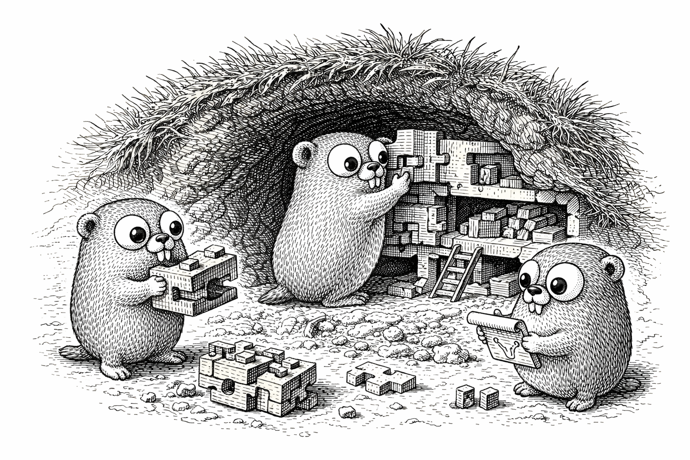

# Burrow

<p align="center">
  
</p>

A Go web framework library built on [Chi](https://go-chi.io/), [Bun](https://bun.uptrace.dev/)/SQLite, and Go's standard `html/template`. Designed around composable apps with a Django-inspired architecture.

## Features

- **App-based architecture** — build your application from composable, self-contained apps
- **Pure Go SQLite** — no CGO required (`CGO_ENABLED=0`), cross-compiles anywhere
- **Per-app migrations** — each app manages its own SQL migrations
- **Standard templates** — Go's `html/template` with a global template set, per-app FuncMaps, and automatic layout wrapping
- **CSS-agnostic** — bring your own CSS framework (Bootstrap, Tailwind, etc.)
- **Layout system** — app layout via server, admin layout via admin package
- **CLI configuration** — flags, environment variables, and TOML config via [urfave/cli](https://github.com/urfave/cli)
- **CSRF protection** — automatic token generation and validation
- **Flash messages** — session-based flash message system
- **Bootstrap integration** — Bootstrap 5 CSS/JS, inline SVG icons, htmx, and dark mode theme switcher
- **Contrib apps** — auth (WebAuthn/passkeys), sessions, i18n, admin, CSRF, flash messages, jobs, uploads, rate limiting, healthcheck, static files

## Quick Start

```go
package main

import (
    "context"
    "log"
    "os"

    "codeberg.org/oliverandrich/burrow"
    "codeberg.org/oliverandrich/burrow/contrib/healthcheck"
    "codeberg.org/oliverandrich/burrow/contrib/session"
    "github.com/urfave/cli/v3"
)

func main() {
    srv := burrow.NewServer(
        session.New(),
        healthcheck.New(),
    )

    cmd := &cli.Command{
        Name:   "myapp",
        Flags:  srv.Flags(nil),
        Action: srv.Run,
    }

    if err := cmd.Run(context.Background(), os.Args); err != nil {
        log.Fatal(err)
    }
}
```

See [`example/hello/`](example/hello/) for a minimal hello world app, or [`example/notes/`](example/notes/) for a complete example with auth, admin, i18n, and more.

## Architecture

```
contrib/        Reusable apps
  admin/        Admin panel coordinator + ModelAdmin
  auth/         WebAuthn passkeys, recovery codes, email verification
  authmail/     Pluggable email renderer + SMTP implementation
  bootstrap/    Bootstrap 5 CSS/JS/htmx assets, theme switcher, layout
  bsicons/      Bootstrap Icons as inline SVG template functions
  csrf/         CSRF protection
  healthcheck/  /healthz endpoint
  htmx/         htmx static asset + request/response helpers
  i18n/         Locale detection and translations
  jobs/         SQLite-backed background job queue
  messages/     Flash messages
  ratelimit/    Per-client rate limiting
  session/      Cookie-based sessions
  staticfiles/  Static file serving with content-hashed URLs
  uploads/      File upload storage and serving
example/        Example applications (hello world, notes app)
```

### The App Interface

Every app implements `burrow.App`:

```go
type App interface {
    Name() string
    Register(cfg *AppConfig) error
}
```

Apps can optionally implement additional interfaces:

| Interface | Purpose |
|---|---|
| `Migratable` | Provide embedded SQL migrations |
| `HasRoutes` | Register HTTP routes |
| `HasMiddleware` | Contribute middleware |
| `HasNavItems` | Contribute navigation items |
| `HasTemplates` | Contribute `.html` template files |
| `HasFuncMap` | Contribute static template functions |
| `HasRequestFuncMap` | Contribute request-scoped template functions |
| `Configurable` | Define CLI flags and read configuration |
| `HasCLICommands` | Contribute CLI subcommands |
| `Seedable` | Seed the database with initial data |
| `HasAdmin` | Contribute admin panel routes and nav items |
| `HasStaticFiles` | Contribute embedded static file assets |
| `HasTranslations` | Contribute translation files |
| `HasDependencies` | Declare required apps |
| `HasShutdown` | Clean up on graceful shutdown |

### Layouts

The app layout wraps user-facing pages:

```go
srv.SetLayout(appLayout)
```

The admin layout is owned by the admin package:

```go
admin.New(admin.WithLayout(layout), admin.WithDashboardRenderer(dashboardRenderer))
```

A `LayoutFunc` receives the response writer, request, status code, rendered content, and template data:

```go
type LayoutFunc func(w http.ResponseWriter, r *http.Request, code int, content template.HTML, data map[string]any) error
```

Layouts access framework values from the request context:

```go
burrow.NavItems(ctx)    // Navigation items from all apps
burrow.Layout(ctx)      // App layout function
csrf.Token(ctx)         // CSRF token for forms
```

### Configuration

Configuration is resolved in order: CLI flags > environment variables > TOML file.

Core flags include `--host`, `--port`, `--database-dsn`, `--log-level`, `--log-format`, `--tls-mode`, and more. Apps can contribute their own flags via the `Configurable` interface.

### Migrations

Apps embed their SQL migrations and implement `Migratable`:

```go
//go:embed migrations
var migrationFS embed.FS

func (a *App) MigrationFS() fs.FS {
    sub, _ := fs.Sub(migrationFS, "migrations")
    return sub
}
```

Migrations are tracked per-app in the `_migrations` table and run automatically on startup.

## Development

```bash
just setup          # Check that all required dev tools are installed
just test           # Run all tests
just lint           # Run golangci-lint
just fmt            # Format code
just coverage       # Generate coverage report
just tidy           # Tidy module dependencies
just example-hello  # Run the hello world example
just example-notes  # Run the notes example application
```

Requires Go 1.25+. Run `just setup` to verify your dev environment.

## Documentation

Full documentation is available in the [`docs/`](docs/) directory.

## License

See [LICENSE](LICENSE). Third-party licenses are listed in [THIRD_PARTY_LICENSES.md](THIRD_PARTY_LICENSES.md).
