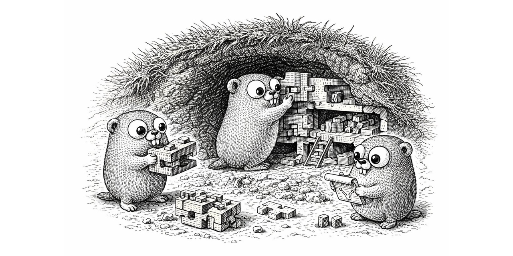

# Burrow

<p align="center">
  
</p>

<p align="center">
  <a href="https://github.com/oliverandrich/burrow/actions/workflows/ci.yml"></a>
  <a href="https://github.com/oliverandrich/burrow/releases"></a>
  <a href="https://go.dev/"></a>
  <a href="https://goreportcard.com/report/github.com/oliverandrich/burrow"></a>
  <a href="/LICENSE"></a>
  <a href="https://burrow.readthedocs.io/"></a>
</p>

A web framework for Go developers who want something like Django, Rails, or Flask — but with the deployment simplicity of a single static binary.

Most Go web development follows the "API backend + SPA frontend" pattern. Burrow takes a different approach: server-rendered HTML with templates, modular apps with their own routes and middleware, and a document database that just works. Deploy with embedded SQLite as a single binary, or connect to PostgreSQL for scale — same code, same API.

Built on [Chi](https://go-chi.io/), [Den](https://github.com/oliverandrich/den) (ODM with SQLite and PostgreSQL backends), and Go's standard `html/template`. Ideal for self-hosted applications, internal tools, or any project where "download, start, use" is the goal.

> [!TIP]
> **Why *Burrow*?** A burrow is a network of interconnected chambers — each with its own purpose, yet part of a larger whole. That's exactly how the framework works: pluggable apps are the rooms, and your gophers live in them.

> [!NOTE]
> Burrow is designed for server-rendered web applications, not API-only services. If you're building a JSON API with a separate frontend, a lighter router like Chi on its own is probably a better fit.

## Features

- **App-based architecture** — build your application from composable, self-contained apps
- **SQLite or PostgreSQL** — embedded SQLite (pure Go, no CGO) for single-binary deploys, or PostgreSQL for scale — switch with one flag
- **Automatic schema** — document types declared in code, tables and indexes created on startup
- **Standard templates** — Go's `html/template` with a global template set, per-app FuncMaps, and automatic layout wrapping
- **Tailwind v4 by default** — `contrib/admin`, `contrib/auth`, and `contrib/jobs` ship Tailwind v4 templates out of the box, and the bundled [`burrow tailwind`](docs/guide/tailwind.md) sub-command auto-discovers every contrib's template directory so utility scanning Just Works. Prefer a different stack? Bring your own CSS and override the contrib templates via `html/template`'s last-define-wins — Burrow's core itself ships no CSS.
- **Layout system** — app layout via server, admin layout via admin package
- **CLI configuration** — flags, environment variables, and TOML config via [urfave/cli](https://github.com/urfave/cli)
- **CSRF protection** — automatic token generation and validation
- **Flash messages** — session-based flash message system
- **htmx-first interactivity** — `contrib/htmx` ships the vendored JS plus response helpers (`OpenDialog`, `SmartRedirect`, etc.) so SSR pages get partial swaps and modals without a JS framework. Dark mode follows `prefers-color-scheme`.
- **Contrib apps** — auth (WebAuthn/passkeys), sessions, i18n, admin, CSRF, flash messages, jobs, uploads, rate limiting, healthcheck, static files

## Quick Start

The fastest path is the bundled `burrow` CLI, which scaffolds a project with the contrib stack, Tailwind v4, live reload, CI, and goreleaser config already wired:

```bash
go install github.com/oliverandrich/burrow/cmd/burrow@latest
burrow new myapp --module github.com/you/myapp
cd myapp && go run ./cmd/myapp
```

Or build from scratch:

```bash
mkdir myapp && cd myapp
go mod init myapp
go get github.com/oliverandrich/burrow@latest
```

```go
package main

import (
    "context"
    "log"
    "net/http"
    "os"

    "github.com/oliverandrich/burrow"
    "github.com/go-chi/chi/v5"
    "github.com/urfave/cli/v3"
)

// homeApp is a minimal app with a single route.
type homeApp struct{}

func (a *homeApp) Name() string { return "home" }
func (a *homeApp) Routes(r chi.Router) {
    r.Method("GET", "/", burrow.Handle(func(w http.ResponseWriter, r *http.Request) error {
        return burrow.Text(w, http.StatusOK, "Hello from Burrow!")
    }))
}

func main() {
    srv := burrow.NewServer(
        &homeApp{},
    )

    cmd := &cli.Command{
        Name:   "myapp",
        Flags:  srv.Flags(nil),
        Action: srv.Run,
    }

    if err := cmd.Run(context.Background(), os.Args); err != nil {
        log.Fatal(err)
    }
}
```

```bash
go mod tidy
go run .
```

See [`example/hello/`](example/hello/) for a minimal hello world app, or [`example/notes/`](example/notes/) for a complete example with auth, admin, i18n, and more.

## Architecture

```
contrib/        Reusable apps
  admin/        Admin panel coordinator (top-nav layout, dashboard cards, route mounting)
  auth/         WebAuthn passkeys, recovery codes, email verification
  authmail/     Pluggable email renderer + SMTP implementation
  csrf/         CSRF protection
  healthcheck/  Liveness and readiness probes
  htmx/         htmx static asset + request/response helpers
  i18n/         Locale detection and translations
  jobs/         SQLite-backed background job queue
  messages/     Flash messages
  ratelimit/    Per-client rate limiting
  session/      Cookie-based sessions
  staticfiles/  Static file serving with content-hashed URLs
  uploads/      File upload storage and serving
example/        Example applications (hello world, notes app)
```

### The App Interface

Every app implements `burrow.App`:

```go
type App interface {
    Name() string
}
```

Apps can optionally implement additional interfaces:

| Interface | Purpose |
|---|---|
| `HasDocuments` | Register Den document types |
| `HasRoutes` | Register HTTP routes |
| `HasMiddleware` | Contribute middleware |
| `HasNavItems` | Contribute navigation items |
| `HasTemplates` | Contribute `.html` template files |
| `HasFuncMap` | Contribute static template functions |
| `HasRequestFuncMap` | Contribute request-scoped template functions |
| `Configurable` | Define CLI flags and read configuration |
| `HasCLICommands` | Contribute CLI subcommands |
| `Seedable` | Seed the database with initial data |
| `HasAdmin` | Contribute admin panel routes and nav items |
| `HasStaticFiles` | Contribute embedded static file assets |
| `HasTranslations` | Contribute translation files |
| `HasDependencies` | Declare required apps |
| `HasJobs` | Register background job handlers |
| `PostConfigurable` | Second-pass configuration after all apps are configured |
| `HasShutdown` | Clean up on graceful shutdown |

### Layouts

Layouts are template name strings. The app layout wraps user-facing pages:

```go
srv.SetLayout("myapp/layout")
```

The admin layout is owned by the admin package:

```go
admin.New(admin.WithLayout("custom/admin-layout"))
```

`RenderTemplate` renders page content, then wraps it in the layout template with `.Content` set to the rendered fragment. Layout templates access dynamic data via template functions:

```html
{{ range navLinks }}...{{ end }}  {{/* filtered nav with active state */}}
{{ if currentUser }}...{{ end }}  {{/* authenticated user */}}
{{ csrfToken }}                   {{/* CSRF token for forms */}}
```

### Configuration

Configuration is resolved in order: CLI flags > environment variables > TOML file.

Core flags include `--host`, `--port`, `--database-dsn`, `--log-level`, `--log-format`, `--tls-mode`, and more. Apps can contribute their own flags via the `Configurable` interface.

### Document Registration

Apps declare their document types by implementing `HasDocuments`:

```go
func (a *App) Documents() []document.Document {
    return []document.Document{&Poll{}, &Choice{}}
}
```

Tables and indexes are created automatically on startup via Den's `Register()`. No SQL migration files needed.

## Development

Burrow uses [mise](https://mise.jdx.dev/) for tool-version pinning and task running. After cloning:

```bash
mise install              # Install pinned Go + dev tools
mise run setup            # Verify the environment + install pre-commit git hooks
```

Common tasks:

```bash
mise run test             # Run all tests
mise run lint             # Run golangci-lint
mise run fmt              # Format code
mise run coverage         # Generate coverage report
mise run tidy             # Tidy module dependencies
mise run example-hello    # Run the hello world example
mise run example-notes    # Run the notes example application
mise tasks                # List every available task
```

## Documentation

Full documentation is available in the [`docs/`](docs/) directory.

## License

Burrow is licensed under the [MIT License](LICENSE).

The Go Gopher was originally designed by [Renee French](https://reneefrench.blogspot.com/) and is licensed under [CC BY 4.0](https://creativecommons.org/licenses/by/4.0/).

Third-party licenses are listed in [THIRD_PARTY_LICENSES.md](THIRD_PARTY_LICENSES.md).
