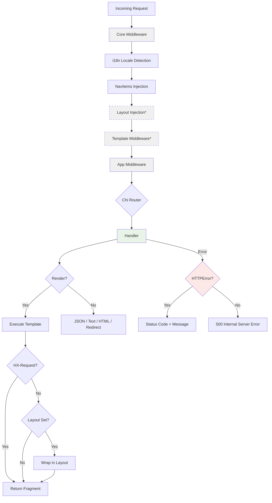

# Routing

Burrow uses [Chi](https://go-chi.io/) as its HTTP router. Chi is a lightweight, composable router built on Go's `net/http` standard library. Burrow adds error-returning handlers and response helpers on top.

## Request Lifecycle

Every HTTP request flows through the following stages:



**Core middleware** includes request logging, request ID generation, response compression, and body size limiting. **App middleware** is contributed by apps via `HasMiddleware` and runs in registration order. Steps marked with **\*** only run when configured — Layout Injection requires a layout template name (via `SetLayout()` or a design system app like `bootstrap`), and Template Middleware requires at least one `HasTemplates` app.

## Handlers

Standard Go HTTP handlers have the signature `func(w http.ResponseWriter, r *http.Request)`. Burrow extends this with an error return value:

```go
type HandlerFunc func(w http.ResponseWriter, r *http.Request) error
```

This lets you use early returns for errors instead of writing error responses manually. Use `burrow.Handle()` to convert a `HandlerFunc` into a standard `http.HandlerFunc`:

```go
r.Get("/notes", burrow.Handle(func(w http.ResponseWriter, r *http.Request) error {
    notes, err := repo.List(r.Context())
    if err != nil {
        return burrow.NewHTTPError(http.StatusInternalServerError, "failed to list notes")
    }
    return burrow.JSON(w, http.StatusOK, notes)
}))
```

### Error Handling

`burrow.Handle()` processes returned errors automatically:

| Error Type | Behavior |
|---|---|
| `*burrow.HTTPError` | Sends the error's status code and message as plain text |
| Any other error | Sends a generic 500 Internal Server Error (the original error is logged but not exposed) |

Errors on 5xx status codes are always logged with the request method and path.

If the response has already started (headers sent), the error is logged but no response is written — you can't change a response that's already in flight.

## Defining Routes

Apps define routes by implementing the `HasRoutes` interface:

```go
func (a *App) Routes(r chi.Router) {
    r.Route("/polls", func(r chi.Router) {
        r.Get("/", burrow.Handle(a.handlers.List))
        r.Get("/{id}", burrow.Handle(a.handlers.Detail))
        r.Post("/", burrow.Handle(a.handlers.Create))
        r.Put("/{id}", burrow.Handle(a.handlers.Update))
        r.Delete("/{id}", burrow.Handle(a.handlers.Delete))
    })
}
```

### HTTP Methods

Chi supports all standard HTTP methods:

```go
r.Get("/path", handler)
r.Post("/path", handler)
r.Put("/path", handler)
r.Patch("/path", handler)
r.Delete("/path", handler)
r.Head("/path", handler)
r.Options("/path", handler)
```

Use `r.Method()` when you need to pass a `http.Handler` instead of a `http.HandlerFunc`:

```go
r.Method("GET", "/path", burrow.Handle(myHandler))
```

### Route Groups

Use `r.Route()` to group routes under a common prefix:

```go
r.Route("/api", func(r chi.Router) {
    r.Get("/users", burrow.Handle(listUsers))
    r.Get("/users/{id}", burrow.Handle(getUser))
})
```

Use `r.Group()` to apply middleware to a subset of routes without adding a prefix:

```go
r.Route("/polls", func(r chi.Router) {
    // Public routes — no authentication required.
    r.Get("/", burrow.Handle(a.handlers.List))
    r.Get("/{id}", burrow.Handle(a.handlers.Detail))

    // Protected routes — require authentication.
    r.Group(func(r chi.Router) {
        r.Use(auth.RequireAuth())
        r.Post("/", burrow.Handle(a.handlers.Create))
        r.Post("/{id}/vote", burrow.Handle(a.handlers.Vote))
    })
})
```

## URL Parameters

Define parameters in the route pattern with `{name}` and read them with `chi.URLParam()`:

```go
r.Get("/notes/{id}", burrow.Handle(func(w http.ResponseWriter, r *http.Request) error {
    id := chi.URLParam(r, "id")
    // ...
}))
```

Chi also supports catch-all parameters with `*`:

```go
r.Get("/files/*", burrow.Handle(func(w http.ResponseWriter, r *http.Request) error {
    path := chi.URLParam(r, "*")
    // path = "images/photo.jpg" for /files/images/photo.jpg
}))
```

## Middleware

Burrow uses the standard Go middleware signature:

```go
func(next http.Handler) http.Handler
```

### Per-Route Middleware

Apply middleware to specific route groups with `r.Use()`:

```go
func (a *App) Routes(r chi.Router) {
    r.Route("/admin", func(r chi.Router) {
        r.Use(auth.RequireAuth())
        r.Use(auth.RequireAdmin())
        r.Get("/", burrow.Handle(a.handlers.Dashboard))
    })
}
```

### Global Middleware

Apps can contribute middleware that applies to all routes by implementing `HasMiddleware`:

```go
func (a *App) Middleware() []func(http.Handler) http.Handler {
    return []func(http.Handler) http.Handler{
        a.rateLimiter,
    }
}
```

Global middleware runs in app registration order, before any route-specific middleware.

## Response Helpers

Burrow provides helpers for common response types:

```go
// Plain text
burrow.Text(w, http.StatusOK, "Hello!")

// HTML string
burrow.HTML(w, http.StatusOK, "<h1>Hello!</h1>")

// JSON
burrow.JSON(w, http.StatusOK, map[string]string{"status": "ok"})

// Render a named template (with automatic layout wrapping)
burrow.Render(w, r, http.StatusOK, "notes/list", map[string]any{
    "Notes": notes,
})

// Redirect
http.Redirect(w, r, "/notes", http.StatusSeeOther)
```

`Render` applies layout logic automatically:

- **HTMX request** (`HX-Request` header) — renders the template fragment only, no layout
- **Normal request with layout** — wraps the fragment in the app layout
- **Normal request without layout** — renders the fragment only

## Request Binding

`burrow.Bind()` parses the request body into a struct and validates it:

```go
func (h *Handlers) Create(w http.ResponseWriter, r *http.Request) error {
    var req struct {
        Title   string `form:"title"   validate:"required"`
        Content string `form:"content"`
    }
    if err := burrow.Bind(r, &req); err != nil {
        return err
    }
    // req.Title and req.Content are populated and validated
}
```

Bind supports JSON (`application/json`), multipart forms (`multipart/form-data`), and URL-encoded forms. See the [Validation guide](validation.md) for details on validation rules and error handling.

## Further Reading

- [Chi documentation](https://go-chi.io/) — full router reference
- [Chi GitHub](https://github.com/go-chi/chi) — examples and middleware catalog
- [Layouts & Rendering](layouts.md) — template rendering and layout system
- [Validation](validation.md) — request validation and error handling
