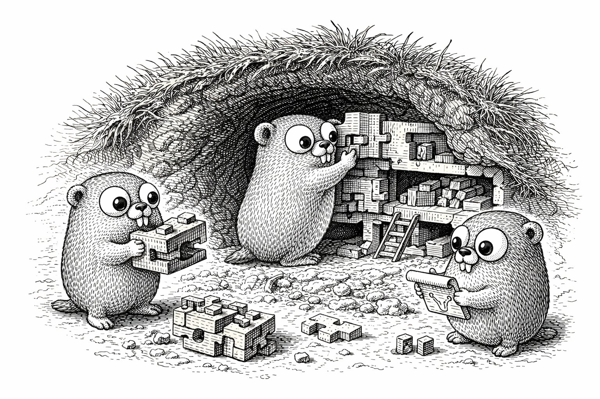

# Burrow

<p align="center">
  
</p>

A web framework for Go developers who want something like Django, Rails, or Flask — but with the deployment simplicity of a single static binary.

Most Go web development follows the "API backend + SPA frontend" pattern. Burrow takes a different approach: server-rendered HTML with templates, modular apps with their own routes, migrations, and middleware, and an embedded SQLite database. The result is an application you can deploy as a single file — `./myapp` and you're done.

Built on [Chi](https://go-chi.io/), [Bun/SQLite](https://bun.uptrace.dev/), and Go's standard [`html/template`](https://pkg.go.dev/html/template). Ideal for self-hosted applications, internal tools, or any project where "download, start, use" is the goal.

!!! note
    Burrow is designed for server-rendered web applications, not API-only services. If you're building a JSON API with a separate frontend, a lighter router like Chi on its own is probably a better fit.

## Features

- **Modular app system** — register self-contained apps with routes, middleware, migrations, and config
- **Pure Go, no CGO** — uses `modernc.org/sqlite` for zero-dependency builds (`CGO_ENABLED=0`)
- **Standard templates** — Go's `html/template` with per-app template files, FuncMaps, and automatic layout wrapping
- **WebAuthn authentication** — passkey-based login with recovery codes and email verification
- **Cookie-based sessions** — encrypted, signed cookies via `gorilla/securecookie`
- **Internationalization** — Accept-Language detection with go-i18n translations
- **Content-hashed static files** — cache-busting URLs computed at startup
- **CSS-agnostic** — bring your own CSS framework and layout templates
- **Convention over configuration** — sensible defaults, override with CLI flags, env vars, or TOML

## Minimal Example

```go
package main

import (
    "context"
    "log"
    "os"

    "github.com/oliverandrich/burrow"
    "github.com/oliverandrich/burrow/contrib/healthcheck"
    "github.com/oliverandrich/burrow/contrib/session"
    "github.com/urfave/cli/v3"
)

func main() {
    srv := burrow.NewServer(
        session.New(),
        healthcheck.New(),
    )

    cmd := &cli.Command{
        Name:   "myapp",
        Flags:  srv.Flags(nil),
        Action: srv.Run,
    }

    if err := cmd.Run(context.Background(), os.Args); err != nil {
        log.Fatal(err)
    }
}
```

```bash
go run . --port 8080
curl http://localhost:8080/healthz
# {"database":"ok","status":"ok"}
```

## Quick Links

- [Installation](getting-started/installation.md) — get the module and prerequisites
- [Quick Start](getting-started/quickstart.md) — build a working app in 5 minutes
- [Creating an App](guide/creating-an-app.md) — build a custom app step by step
- [Tutorial](tutorial/index.md) — hands-on guide building a polls app from scratch
- [Contrib Apps](contrib/session.md) — use the built-in session, auth, i18n, and more
- [Configuration Reference](reference/configuration.md) — every flag, env var, and TOML key
